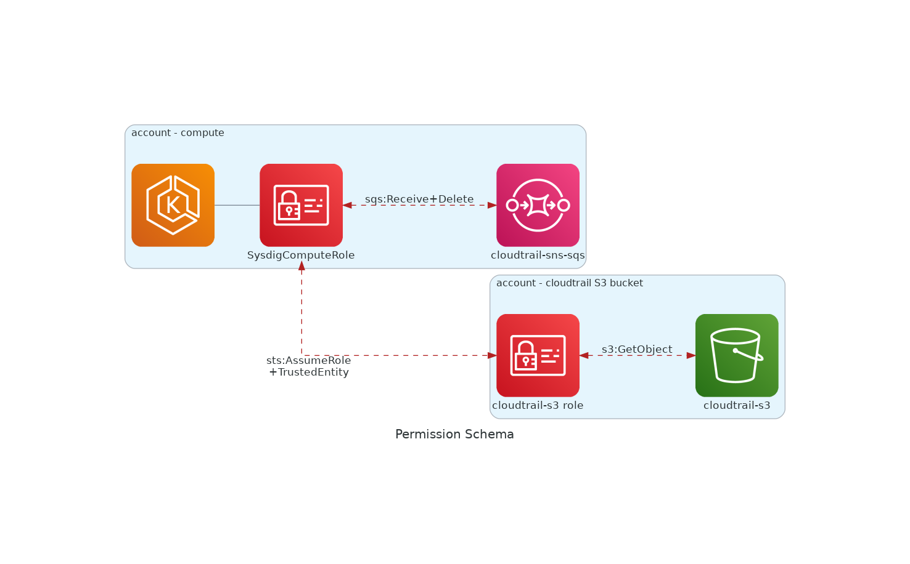

# Secure for Cloud - Organizational

## Use-Case explanation

**Current User Setup**

- AWS Organization setup
- AWS Organizational Cloudtrail with a managed account level SNS activated + reporting to an S3 bucket
- K8s cluster available for Sysdig compute workload to deploy
- Permission provisioning will be performed manually

**Sysdig Secure for Cloud [Features](https://docs.sysdig.com/en/docs/installation/sysdig-secure-for-cloud/)**

- Threat-Detection
- Posture; Compliance + Identity Access Management
<br/><br/>

## Suggested building-blocks

### 1. **Compliance setup** on Sysdig backend and AWS Accounts

On each member-account where compliance wants to be checked, we need to provide a role for Sysdig to be able to impersonate and
perform `SecurityAudit` tasks.

In addition, we must make Sysdig aware of this accounts and role. 
We will guide you to provide, on the Sysdig Secure SaaS backend, the following resources:
- a cloud-account for each member account of your organization where compliance is wanted to be checked
- a task that will run "aws_foundations_bench-1.3.0" schema on previously defined accounts

Perform the following steps.
- 1.1 Provision Sysdig Secure SaaS Backend with the [sysdig_cloud_compliance_provisioning.sh](../../utils/sysdig_cloud_compliance_provisioning.sh) script.
  - Review and provide required values before launching
  - Gather `TrustIdentity` and `ExternalId` values.
- 1.2 Now create `SysdigComplianceRole` on each member account, using [Sysdig Compliance IAM policy](../../general_templates/ComplianceAgentlessRole.yaml) as guidance
and using the values gathered in previous step.
<br/><br/>

### 2. Prepare **EKS SysdigComputeRole**

In further steps, we will deploy Sysdig compute workload inside an EKS cluster.
We are going to need a `SysdigComputeRole`, to configure some permissions to be able to fetch the required data.
Have this role ARN at hand.

QuickTest Notes:
- If your EKS cluster has no specific authentication setup, you can get the `eks_nodes` role generated by default in EKS.

<br/><br/>
### 3. **Cloudtrail SQS**

In order to ingest cloudtrail events we will need a queue endpoint.
Access your cloudtrail and activate SNS notification if it's not already available.

Now **create** an SQS queue (preferably in the same region as the SNS, and in the same account as where the EKS cluster is), 
and subscribe the SNS topic to it.

If SQS and EKS cluster are within the same account, you will only need to give **permissions** to either SysdigCompute IAM role or SQS.
[Otherwise, you will need to provide permissions for both](https://aws.amazon.com/premiumsupport/knowledge-center/sqs-accessdenied-errors/#Amazon_SQS_access_policy_and_IAM_policy) <br/>
Use following snipped if required
```txt
 {
      "Sid": "AllowSysdigProcessSQS",
      "Effect": "Allow",
      "Principal": {
        "AWS": "<ARN_SYSDIG_COMPUTE_ROLE>"
      },
      "Action": [
        "SQS:ReceiveMessage",
        "SQS:DeleteMessage",
        "SQS:DeleteMessageBatch"
      ],
      "Resource": "<ARN_CLOUTRAIL_SNS_SQS>"
    }
```
<br/><br/>


### 4. **Cloudtrail-S3 Account AssumeRole**

This step is required when Cloudtrail-S3 bucket is stored in a different account than the cluster where we will deploy Sysdig workload.
We will need to create a role to assume from our workload, due to cross-account S3 restrictions.

Create a `SYSDIG_S3_ACCESS_ROLE` role and give it following **permission** Statement 
```
 {
    "Sid": "AllowSysdigReadS3",
    "Effect": "Allow",
    "Action": [
        "s3:GetObject"
    ],
    "Resource": "<ARN_CLOUDTRAIL_S3>/*"
}
```

We will also allow a Trust Relationship, for Sysdig Compute to be able to assume this role
```
{
    "Sid": "AllowSysdigAssumeRole",
    "Effect": "Allow",
    "Principal": {
        "AWS": "<ARN_SYSDIG_COMPUTE_ROLE>"
    },
    "Action": "sts:AssumeRole"
}
```

Now we will need to perform same **permissions setup on the S3 bucket**. Add following Statement to the **Bucket policy**

```text
{
    "Sid": "AllowSysdigReadS3",
    "Effect": "Allow",
    "Principal": {
        "AWS": "<ARN_SYSDIG_S3_ACCESS_ROLE>"
    },
    "Action": "s3:GetObject",
    "Resource": "<ARN_CLOUDTRAIL_S3>/*"
}
```
<br/><br/>


### 5. **Sysdig Compute** Workload deployment in **K8s**

First let's review permission schema.

Following Step2. We will setup `SysdigComputeRole`, to be able to work with the SQS and S3 resources.

```text
{
    "Version": "2012-10-17",
    "Statement": [
	    {
            "Effect": "Allow",
            "Action": [
                "SQS:ReceiveMessage",
                "SQS:DeleteMessage",
                "SQS:DeleteMessageBatch"                
            ],
            "Resource": "<ARN_CLOUDTRAIL_SNS_SQS>"
        },
        {
            "Effect": "Allow",
            "Action": [
                "sts:AssumeRole"
            ],
            "Resource": "<ARN_SYSDIG_S3_ACCESS_ROLE>"
        }
    ]
}
```

We will make use of the [Sysdig cloud-connector helm chart](https://charts.sysdig.com/charts/cloud-connector/) component.

Provided the following `values.yaml` template
```helm
-- values.yaml suggestion
sysdig:
  url: "https://secure.sysdig.com"
  secureAPIToken: "SYSDIG_API_TOKEN"
telemetryDeploymentMethod: "helm_aws_k8s_org"		# not required but would help product
aws:
    region: <SQS-AWS-REGION>
ingestors:
    - cloudtrail-sns-sqs: 
        queueURL:"<URL_CLOUDTRAIL_SNS_SQS>"             # step 3 
        assumeRole:"<ARN_ROLE_SYSDIG_S3_ACCESS>"        # step 4
```

We will install it
```shell
$ helm upgrade --install --create-namespace -n sysdig-cloud-connector sysdig-cloud-connector sysdig/cloud-connector -f values.yaml
```


Test it
```shell
$ kubectl logs -f -n sysdig-cloud-connector deployment/sysdig-cloud-connector
```

And if desired uninstall it
```shell
$ helm uninstall -n sysdig-cloud-connector sysdig-cloud-connector
```


## Testing

Check within Sysdig Secure
- Integrations > Cloud Accounts
- Posture > Compliance  for the compliance task schedule
- Insights > Cloud Activity
